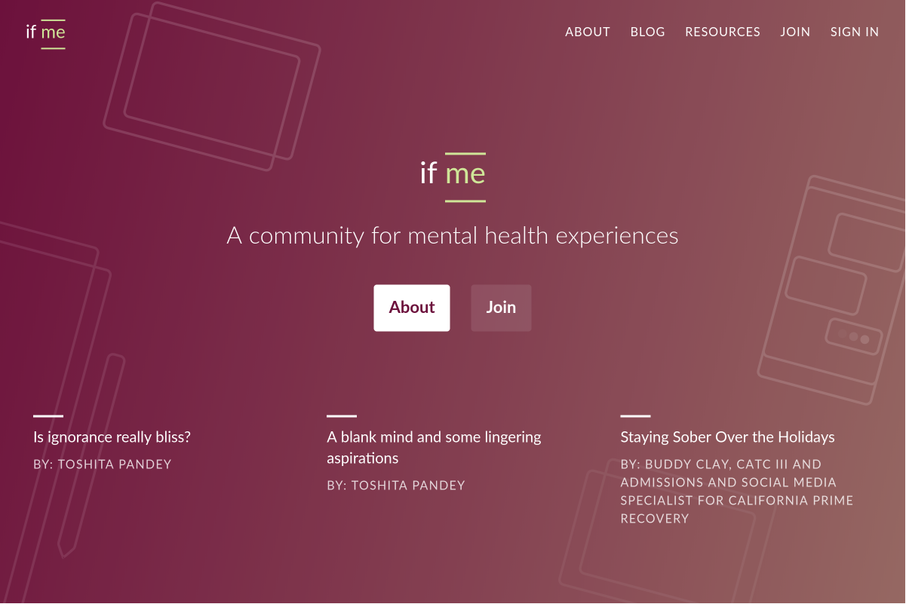

_These are my thoughts and experiences around getting involved in open source software through a project called [if me](https://www.if-me.org/). This is for anyone who has wanted to get into open source but hasn't yet._

### Why Open Source?

I've been intrigued by open source for years. Some in the developer community attribute a lot of their learnings and successes to open source, and I use open source software on the daily. I've also always wondered what a software-building environment that isn't purely driven by profits looked like.

Curiosity was my main drive. I just never knew where to start.

### Finding My First Open Source Project

I first determined a couple key factors I was looking for in a potential project to contribute to:

1. _It must be software for good_. In other words, I'm only interested if it's trying to better people's lives in an obvious way.
2. _It must use the technologies I love_. I could've looked for a project in a stack I'm not familiar with to learn it, but I was interested in developing a deeper knowledge for what I already knew and loved (Ruby on Rails).

Obviously, these are different for everybody, but knowing my priorities made finding a great fit easier.

I searched for various lists of open source projects with this criteria and ended up just browsing GitHub repositories by topic. [if me](https://www.if-me.org/) was a project that was featured in GitHub's social impact collection that caught my eye immediately. Not only was it a Rails project, but it was tackling a meaningful issue: mental health.

At the time, the project's documentation encouraged interested contributors to reach out via email, so I sent one explaining my interest and willingness to contribute. The founder of the project, [Julia Nguyen](https://mobile.twitter.com/fleurchild), responded promptly and added me to the organization's Slack. While having a Slack group wasn't 100% necessary, it has been an amazing tool to get to know the other contributors better outside of GitHub discussions.

### First Contribution

My first contribution ended up actually not being code at all. It was design.

Julia laid out various areas I could start tackling as a first-time contributor. These were all documented as GitHub issues in the project repo as well. One of them was assisting with an app redesign, which in my mind affected all other contribution opportunities.

I expressed interest in starting the redesign efforts, got a thumbs up, and spent spare afternoons and evenings working on mockups. Once a rough direction started taking shape, [I opened a new GitHub issue](https://github.com/ifmeorg/ifme/issues/691) to share.

It was great collecting feedback from other contributors via Slack and GitHub to iterate on the design. Because open source software brings people of diverse backgrounds together, I was exposed to a lot of insights I wouldn't have thought of by myself in a silo or even in a company.

The design was eventually implemented by the community and is continually being iterated on.

### The Community Is the Most Important Part

As I engaged more with the project, I realized that the community of contributors really defined the open source experience for me.

Julia is extremely welcoming as are all the other contributors. Discussions can include everything from helping people determine their first GitHub issue to chatting about how Neopets kick-started our careers.

if me has a culture of empowering contributors to lead initiatives. The implementation of my design corresponded with the adoption of React in the codebase, so I was encouraged to create GitHub issues for individual components and review pull requests for them. This taught me that contributing code isn't the only way to grow as an engineer -- reviewing contributions and communicating effectively is just as, if not more, impactful.

I eventually got around to contributing code to the project as well. Refactoring efforts were a large part of what I worked on so far, and it gave me insights into how large teams effectively architect and maintain codebases.

During this time, a team from [Rails Girls Summer of Code](https://railsgirlssummerofcode.org/) got involved with contributing to the project. [I had the chance](https://mobile.twitter.com/ifmeorg/status/1045722350291832832) to work with two incredibly talented individuals, Atibhi and Prateksha, from Bangalore, India through various pull requests and discussions. Helping them in their journey to gain more engineering experience alongside other mentors was invaluable experience for myself as well.

My most recent contributions involve reviewing Japanese translations, which is something that I've never had the opportunity to help with at a day job.

### Closing Thoughts

Getting involved with open source was one of the best decisions I've made for my career. I've learned that open source is not just about contributing code -- filing issues, creating designs, reviewing contributions, mentoring others, being mentored, having discussions with incredible people, and being part of a community can all be a part of the open source experience as well.

There's really nothing stopping you from starting your open source journey if you're interested. Give it a shot sometime, and I bet it'll be full of pleasant surprises.
